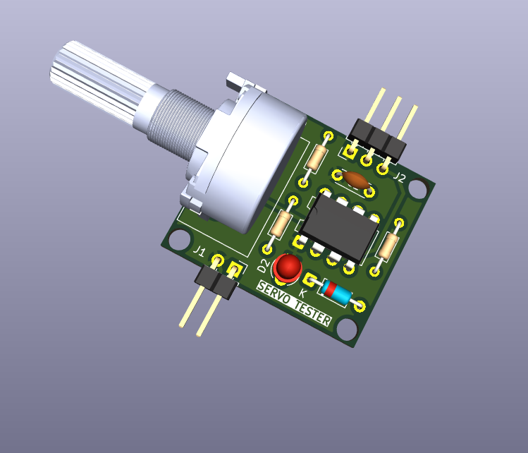
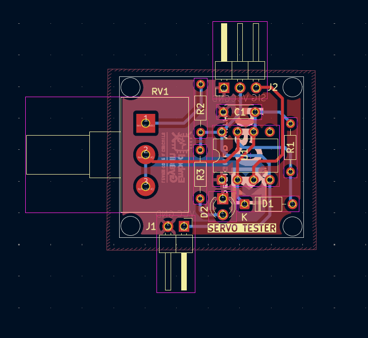

# Servo Tester PCB

This repository contains the complete design files for a **Servo Motor Tester**.  
It is built using a **555 Timer IC** to generate PWM signals that can drive and test RC servo motors.  

---

## 📌 Features
- Based on the popular **NE555 Timer IC**.
- Adjustable PWM signal using a **potentiometer**.
- Can test servo motors by simulating control signals.
- Compact **2-layer PCB** design.
- Includes **Gerber files, interactive BOM, and 3D renders**.

---

## 📂 Repository Contents
- `Schematic/` → Circuit schematic (`.sch`)
- `PCB/` → PCB design files (`.kicad_pcb`)
- `Gerber/` → Fabrication-ready Gerber files
- `3D_Model/` → 3D renders of the PCB
- `ibom.html` → Interactive Bill of Materials
- `README.md` → Documentation

---

## 🛠️ Circuit Description
The servo tester circuit works as follows:
- **NE555 Timer IC** is configured in **astable mode** to generate variable duty cycle PWM.
- A **potentiometer** adjusts the pulse width (1 ms – 2 ms), which corresponds to servo motor position.
- An **LED indicator** shows the activity of the circuit.
- Power supply is provided via standard 5V (from external source).

This design is useful for testing and calibrating servo motors without requiring a microcontroller.

---

## 🚀 Usage
1. Connect **5V supply** to the PCB.
2. Connect your **servo motor** to the output header.
3. Adjust the **potentiometer knob** to move the servo motor.
4. Observe smooth movement as PWM duty cycle changes.

---

## 📷 PCB Preview
### 3D Model

### PCB Layout

---

## 📑 Gerber Files
Gerber files for PCB manufacturing are available in:
